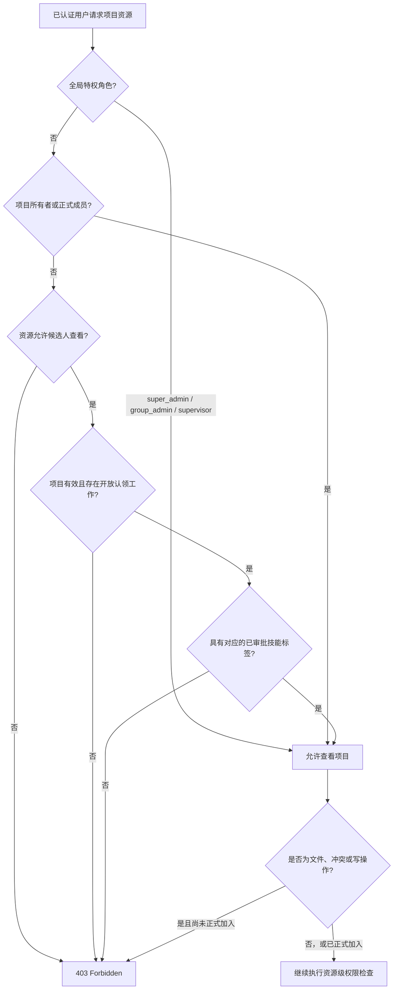
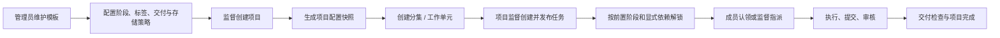
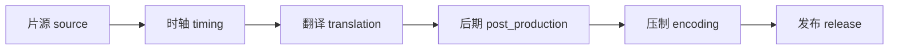
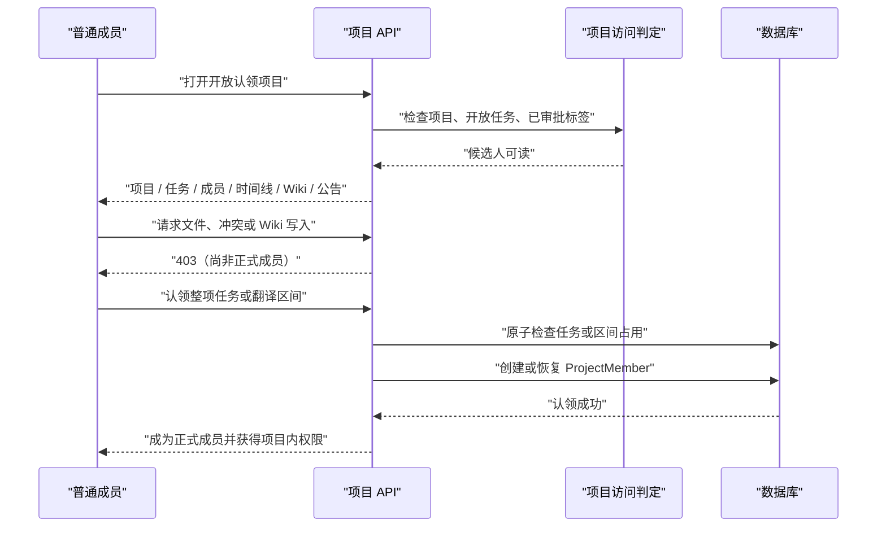
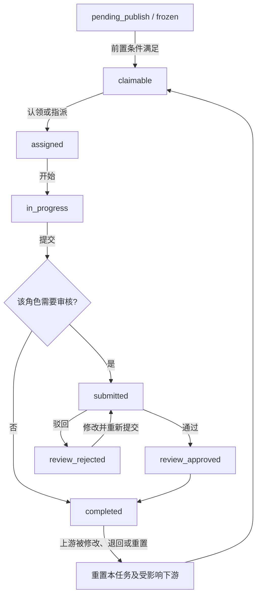

# 字幕组项目工作流与权限细则

本文基于提交 `4c3b463477a7197923ade1345e4217b0dbc61854` 及本次权限修复后的实现整理。权限判断不是单一角色表，而是由全局角色、项目关系、任务状态和已审批技能标签共同决定。

## 1. 权限判定模型

一次项目资源访问依次检查：

1. 请求是否已认证，账号是否可用。
2. 全局角色是否具备跨项目权限。
3. 用户是否为项目所有者或未退出的正式项目成员。
4. 若仅申请查看，是否满足开放认领候选人条件。
5. 对文件、冲突、Wiki 写入、任务评论、任务管理等敏感操作，再检查正式成员关系、项目职责和任务状态。

开放认领候选人必须同时满足：项目未删除、未归档；存在当前可认领任务或仍有空余区间的翻译任务；用户满足该岗位的标签规则。非翻译任务仅在状态为 `claimable` 时视为开放。翻译任务在状态为 `claimable` 时视为开放；处于 `assigned`、`in_progress`、`submitted` 或 `review_approved` 时，还必须具有分集总时长，且 `pending`、`active`、`submitted`、`approved` 区间的合并覆盖尚未达到总时长。若项目或模板为该角色配置了 `requiredTagIds`，以这些标签为准；否则按已审批标签的 `role_type` 与岗位匹配，不依赖标签显示名称。若系统尚未定义该岗位对应的默认标签，则不因标签缺失拒绝认领或候选访问。

项目列表与项目详情是两层可见性：已认证账号可读取项目目录，默认查询排除已归档和已删除项目；看到项目卡片不代表可以进入详情。无项目关系用户只要对任意一个开放岗位满足标签规则，即获得该项目的候选只读权限，并可读取项目详情、全部任务列表及任务详情，而不只限于触发资格的开放任务。开放工作关闭、匹配标签被撤销或项目归档后，候选资格立即失效；正式成员、项目所有者、既有任务负责人和全局特权角色仍按各自关系判定。

## 2. 项目建立与执行链路

项目通常由全局管理员或全局监督创建。使用模板创建时，系统快照模板的工作流、角色要求、交付清单、存储与上传策略，后续修改模板不会反向改变已有项目。

默认串行阶段如下。项目可通过工作流配置禁用某些阶段；每个启用阶段必须等待同一工作单元中的前一启用阶段全部完成，同时还必须满足显式任务依赖。

- `source`、`timing`：提交后可直接完成，并解锁下游。
- `translation`：支持按时间区间竞争认领；同一分集的翻译任务共享区间占用状态。
- `translation`、`post_production`、`encoding`、`release`：提交后必须由项目管理者审核。
- 监督可在填写原因后越过尚未满足的依赖进行指派，操作会写入审计记录。

## 3. 开放认领链路

整项认领使用条件更新保证并发下只能有一个成功者，失败者收到 `409`。翻译认领校验区间重叠、分集时长、单段上限、用户累计认领时长以及技能标签；认领成功后同样创建或恢复正式成员关系。监督手动预指派或重新指派任务时，也会创建或恢复被指派人的项目成员关系；历史数据中只有任务负责人记录的用户仍按项目参与者处理。

翻译认领和提交统一使用任务接口 `claim-segment`、`abandon-segment` 与 `submit-translation`。旧字幕模块中会自动创建翻译任务、采用不同覆盖阈值的平行写入口不再暴露，避免同一工作流出现两套标签、区间和状态规则。

## 4. 任务状态、审核与级联

上游任务被修改、强制退回、删除或手动重置时，系统同时检查显式依赖和配置的下一阶段：

- 未开始的下游任务回到可认领或已指派状态。
- 已进行、已提交或已完成的下游任务被重置，并通知负责人。
- 非发布角色保留文件历史；发布角色重置时会丢弃其发布产物，避免继续传播失效结果。
- 已通过的翻译认领会在翻译任务重置时重新开放。

非翻译任务审核驳回后保持原负责人和成果归属，进入 `review_rejected`；原负责人或项目管理者可修改成果并直接重新提交。项目归档时逐任务保存归档前状态，取消归档只恢复由本次归档冻结的任务；原本手工冻结的任务保持冻结，负责人不发生变化。

## 5. 全局角色

| 角色 | 范围 | 关键权限与限制 |
| --- | --- | --- |
| `super_admin` | 全系统 | 唯一账号；可管理全局配置、管理员、成员、模板、存储及所有项目，可执行任意项目任务操作。只有它可以授予 `super_admin`，且不能把自身降级。 |
| `group_admin` | 全系统管理 | 可管理普通账号、技能标签、模板、存储和项目；不能创建、接管、改密、停用、删除或降级 `super_admin`。 |
| `supervisor` | 全局业务监督 | 可跨项目查看和管理业务项目、创建项目和成员；不具备管理员账号、模板和存储配置的完整管理权。 |
| `member` | 按项目与任务授权 | 仅访问自己参与的项目，或作为匹配技能的开放认领候选人获得有限只读权限。 |

数据库通过可空唯一字段 `super_admin_marker = "singleton"` 保证最多一个超级管理员；初始化和迁移同时保证至少保留一个既有超级管理员，因此部署后的目标状态是恰好一个。

## 6. 项目关系

| 项目身份 | 查看项目 | 文件与冲突 | Wiki | 任务执行 | 项目管理 / 审核 |
| --- | --- | --- | --- | --- | --- |
| 全局管理员 / 全局监督 | 全部项目 | 允许 | 允许 | 可执行项目内全部任务操作 | 允许 |
| 项目所有者 | 允许 | 允许 | 允许 | 可监督 | 允许；创建项目时自动成为项目监督 |
| 项目监督 | 允许 | 允许 | 允许 | 可负责具体任务，也可分配、开始、代提交、回滚、重置及监督任务 | 可配置项目、成员、分集、任务和生命周期，可审核自己提交的任务及处理冲突 |
| `is_lead` 项目负责人 | 允许 | 允许 | 允许 | 可分配、开始、代提交、回滚、重置及审核任务 | 可处理 Wiki 审核、公告和字幕冲突；不能修改项目设置、成员、分集或项目生命周期 |
| 正式普通成员 | 允许 | 允许 | 可读；写入版本按 Wiki 审核流程处理 | 已指派、已认领，或拥有目标岗位所需标签时可认领；不要求项目成员记录中的单一角色与岗位相同 | 无项目管理或任务审核权 |
| 开放认领候选人 | 有开放工作且技能匹配时允许 | 不允许 | 只读 | 仅可认领匹配角色的开放工作 | 不允许 |
| 无关成员 / 匿名用户 | 不允许 | 不允许 | 不允许 | 不允许 | 不允许 |

候选人可读范围严格限定为项目详情、任务列表与详情、成员列表、项目时间线、项目 Wiki 和项目公告。文件列表、项目冲突、字幕冲突详情、任务评论、Wiki 写入及其他成员专属数据必须等到认领成功或加入申请获批后才能访问。

## 7. 任务操作细则

| 操作 | 允许主体 | 主要约束 |
| --- | --- | --- |
| 查看任务 | 全局特权角色、项目正式参与者、匹配的开放认领候选人 | 必须认证；候选资格随开放任务和标签实时变化 |
| 整项认领 | 具有项目指定标签或岗位默认标签的用户，以及项目管理者 | 任务必须为 `claimable`、依赖满足、非翻译任务；未定义岗位默认标签时不因标签拒绝；并发冲突返回 `409` |
| 翻译分段认领 | 具有项目指定翻译标签或默认翻译标签的用户，以及项目管理者 | 区间合法、不重叠、未超项目和用户限制；当前负责人也可继续认领其他空余区间；可排队激活 |
| 指派 / 强制指派 | 项目监督、项目负责人或全局特权角色 | 越过依赖时必须填写原因并审计 |
| 开始 | 当前负责人、对应翻译认领人或项目管理者 | 状态和前置条件必须允许；管理者可代为开始，但已有负责人保持不变 |
| 提交、退回 | 当前负责人、对应翻译认领人或项目管理者 | 状态必须允许；项目管理者可代提交或执行受控强制退回，代提交不改变既有负责人和成果归属 |
| 审核通过 / 驳回 | 项目监督、项目负责人或全局特权角色 | 项目监督可以审核自己负责并提交的任务 |
| 手动重置、删除活动任务 | 项目监督、负责人或全局特权角色 | 会检查并级联重置下游 |
| 文件版本审批、删除他人链接 | 项目所有者、项目监督、`is_lead` 或全局特权角色 | 必须回溯文件或链接所属项目；普通成员只能管理自己创建的链接 |
| 处理冲突、合并与审核写入 | 项目管理者或指定审核职责 | 需要正式项目访问，候选人无权操作 |

项目管理入口还包括归档、取消归档、移入和恢复回收站、成员与分集管理、加入申请审核。它们必须在服务层校验全局管理员 / 全局监督、项目所有者或项目监督身份；仅登录、仅正式成员或仅 `is_lead` 均不足以执行这些项目配置操作。移除成员只回收其未完成任务和活动翻译认领，已提交、已审核和已完成记录继续保留原负责人及成果归属。

## 8. 维护要求

- 新增项目级接口时，读取路径应统一调用 `assertProjectViewPermission`；敏感资源传入 `allowOpenClaimCandidate: false`。
- 控制器只负责提取已认证用户，资源归属和对象级授权应在服务层再次校验，避免通过其他路由绕过。
- 新增任务角色时必须同步角色标签、模板快照、开放认领资格、工作流顺序和权限测试。
- 项目未配置 `requiredTagIds` 时，认领资格必须回退到 `RoleTag.role_type`；同一成员可凭不同岗位标签认领多个岗位，不应受 `ProjectMember.role` 的单值限制。
- 权限测试至少覆盖匿名用户、无关成员、匹配候选人、正式成员、项目监督和全局管理员，并同时验证允许与拒绝路径。
